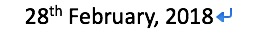

## 考察H5新增的sup标签

如何实现下面的效果？



代码如下：
```html
28<sup>th</sup> February, 2018
```

和它对应的还有sub下标标签。

链接： [sup](https://developer.mozilla.org/zh-CN/docs/Web/HTML/Element/sup)
[sub](https://developer.mozilla.org/en-US/docs/Web/HTML/Element/sub)


